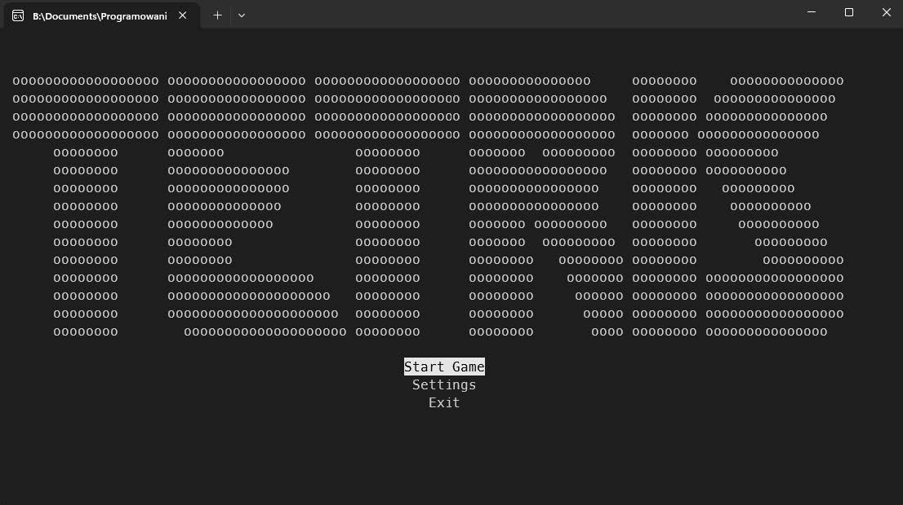
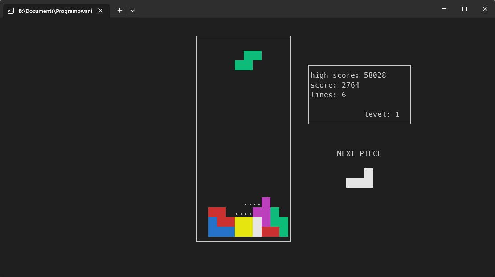

# termtris

**termtris** is a terminal-based game engine project that includes an implementation of the classic game Tetris.  
It's fully playable inside a terminal window.





## Installation

This project is currently Windows-only.
The JSON parser is header-only and included in the repository, so no additional installation is needed.


### Install PDCurses via vcpkg
```
git clone https://github.com/microsoft/vcpkg.git
cd vcpkg
.\bootstrap-vcpkg.bat
.\vcpkg install pdcurses
```

Make sure to integrate vcpkg with Visual Studio:
```
.\vcpkg integrate install
```
### Clone the Project
```
git clone https://github.com/your-username/your-project.git
cd your-project
```

### Build with Visual Studio

Open the project in Visual Studio.

Set the C++ Language Standard to C++20:
```
Project > Properties > C/C++ > Language > C++ Language Standard > /std:c++20
```

Make sure PDCurses is linked correctly via vcpkg or your preferred method.

Build.

## Overview

The engine consists of a logical layer responsible for managing game state and rules, and a rendering layer responsible for displaying content in the terminal. Input is handled asynchronously, while a dedicated timing system ensures consistent game ticks regardless of rendering speed. The project also includes a persistent save system used to store settings and high scores between runs.

The architecture is intentionally modular, making it possible to replace or extend individual subsystems without rewriting the entire application.

## Gameplay

The goal of the game is to score points by arranging falling tetrominoes into complete horizontal lines. When a line is fully filled, it is cleared from the board and the player is awarded points. Clearing multiple lines at once results in higher rewards. The game continues until a new piece can no longer be placed on the board, at which point the game ends.

Tetrominoes fall automatically under gravity, but the player may move and rotate them while they descend. The game features a level system that increases difficulty over time by speeding up the falling pieces. Higher levels require clearing more lines and significantly increase the challenge.

A ghost piece is displayed to indicate where the current tetromino will land if dropped immediately, allowing for more precise planning. Optionally, the game can also show the next upcoming piece to support more advanced strategies.

## Settings

- **ASCII mode** - a mode in which ASCII characters are used for rendering instead of colors.
- **Flashing effects** - enables / disables flashing visual effects, which may trigger epilepsy in some players.
- **Randomness** - allows selecting the randomization model used by the game to generate new pieces:
    - **TGM3** (from TETRIS: The Grand Master 3) - more balanced, offering more engaging gameplay.
    - **pure** - a true uniform distribution in which each piece is equally likely.
- **Show future piece** - displays the next upcoming piece on the side of the screen. This is not an official TETRIS mechanic, but it allows for more complex strategies and adds variety to the gameplay.
- **Start Level** - allows selecting the starting level.

## Controls

### Menus

| Key     | Action            |
| ------- | ----------------- |
| ↑ / W   | Move up           |
| ↓ / S   | Move down         |
| ← / A   | Decrease value    |
| → / D   | Increase value    |
| Enter   | Select / toggle   |
| Esc     | Back / exit       |

### In-Game

| Key     | Action                     |
| ------- | -------------------------- |
| ← / A   | Move left                  |
| → / D   | Move right                 |
| ↓ / S   | Soft drop                  |
| ↑ / W   | Hard drop                  |
| Q / J   | Rotate clockwise           |
| E / K   | Rotate counter-clockwise   |
| Esc     | Quit game                  |

## Scoring and Progression

Points are awarded for accelerating the fall of tetrominoes as well as for clearing lines. Soft drops and hard drops both grant bonus points that scale with the current level. Clearing one or more lines at once grants increasing rewards, also multiplied by the current level. If a line clear results in an entirely empty board, a Perfect Clear bonus is applied, dramatically increasing the score.

The game features a level progression system in which advancing to higher levels requires clearing a growing number of lines. Each level increase raises the falling speed of the pieces, making precise placement increasingly important.

## Randomization

The game supports two different tetromino randomization models. One is inspired by Tetris: The Grand Master 3 and aims to produce a fairer and more engaging distribution of pieces. The other uses a purely uniform distribution, where every tetromino has the same probability of appearing at any time. The preferred model can be selected in the settings menu.

## Legal

TETRIS is a registered trademark of The Tetris Company.

This project is an independent, non-commercial, educational implementation inspired by the rules of the Tetris game. It is not affiliated with, endorsed by, or associated with The Tetris Company. No ownership or rights to the Tetris trademark, name, or branding are claimed.

This project is licensed under the Creative Commons Attribution-NonCommercial 4.0 International License.
